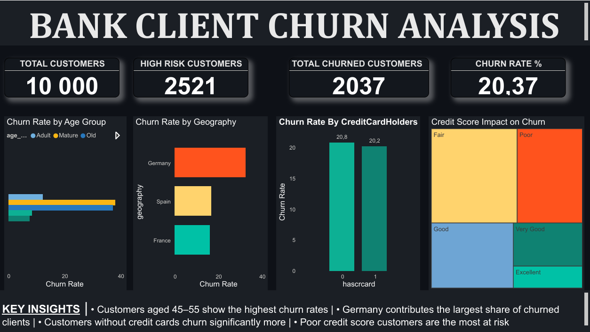
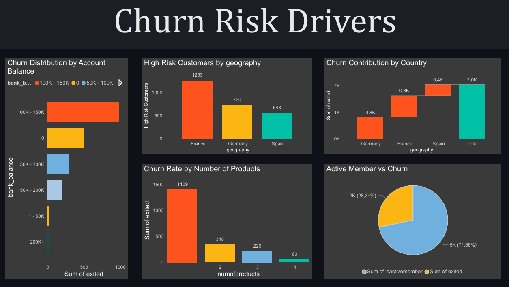
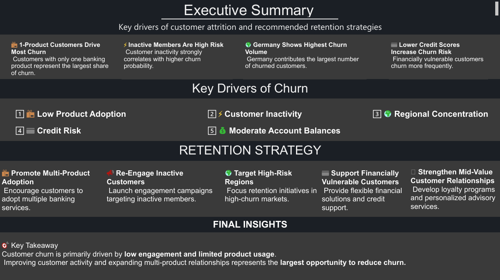
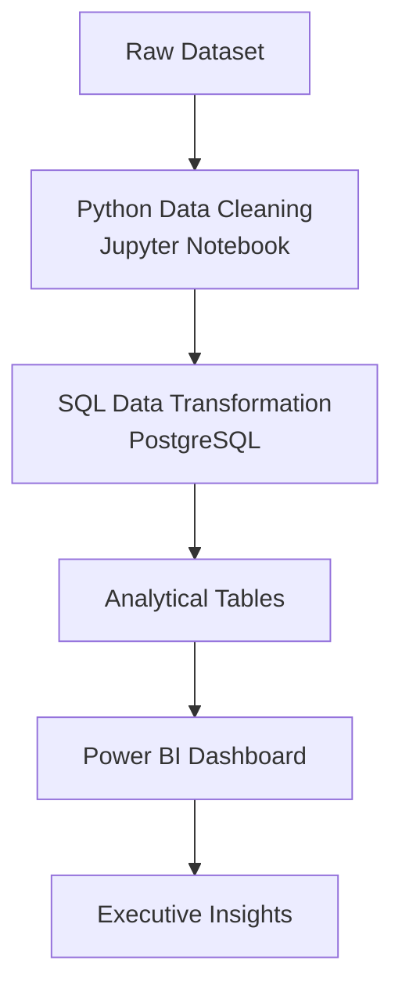
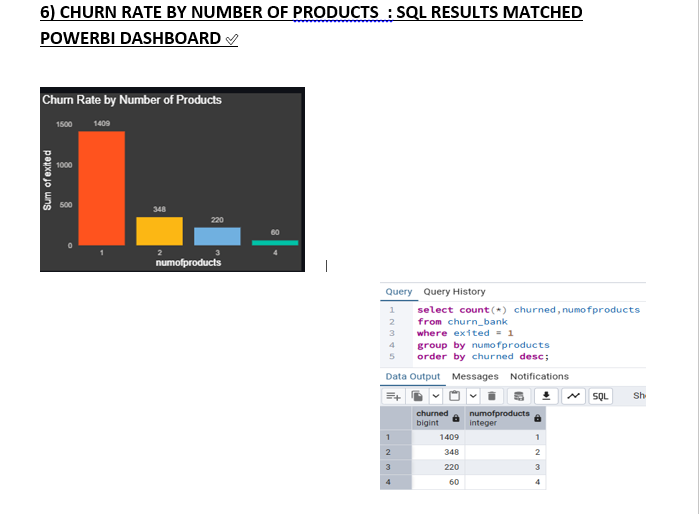

# 📊 Bank Customer Churn Analysis

## 🔥 Dashboard Preview





🔗 Download Full Dashboard (PBIX): dashboards/Bank_churn_final_dash.pbix

A full-stack analytics project combining **Python data engineering, SQL analytics, and Power BI business intelligence** to identify key drivers of customer churn and propose retention strategies.

This project demonstrates a **complete end-to-end analytics workflow used in real business environments**, transforming raw banking data into actionable insights for decision makers.

---

# 📑 Table of Contents

- Project Overview  
- Key Results  
- Business Problem  
- Tech Stack  
- Dataset  
- Project Architecture  
- Data Cleaning (Python)  
- SQL Data Modeling  
- KPI Validation  
- Dashboard Overview  
- Business Recommendations  
- Repository Structure  
- Skills Demonstrated  
- Contact  

---

# 📌 Project Overview

The dataset contains **10,000 bank customers** with demographic, financial, and behavioral attributes.  
This dataset is widely used in **customer churn prediction and banking analytics studies**.

The workflow simulates the **typical responsibilities of a data analyst in a financial institution**:

1. Data preparation and cleaning using Python  
2. Analytical transformation and KPI generation using SQL  
3. Interactive dashboard creation in Power BI  
4. KPI validation to ensure analytical accuracy  

The goal is to convert **raw customer data into meaningful insights** that help banks reduce churn and improve retention.

---

# 🚀 Key Results

- Identified **5 major drivers of customer churn**
- Built a complete **Python → SQL → Power BI analytics pipeline**
- Validated **dashboard KPIs using SQL queries**
- Customers with **only one product are 4× more likely to churn**
- **Germany contributes the largest share of churned customers**
- Overall churn rate identified as **20.37%**

---

# 🧠 Business Problem

Customer churn significantly impacts revenue in the banking sector.  
Acquiring a new customer is **significantly more expensive than retaining an existing one**.

This analysis answers the following business questions:

- Which customer segments are most likely to churn?
- What financial and behavioral factors drive churn?
- How does geography influence customer attrition?
- What strategies can reduce churn risk?

---

# 🛠 Tech Stack

| Tool | Purpose |
|-----|------|
| Python | Data cleaning and preprocessing |
| Pandas | Data transformation |
| Jupyter Notebook | Data preparation |
| PostgreSQL | Data storage and querying |
| SQL | KPI generation and validation |
| Power BI | Interactive business dashboards |
| GitHub | Documentation and version control |

---

# 📂 Dataset

The dataset contains **10,000 bank customers**.

Key attributes include:

- Customer ID
- Geography
- Age
- Credit Score
- Number of Bank Products
- Account Balance
- Credit Card Ownership
- Activity Status
- Churn Indicator (Exited)

The data was **cleaned, validated, and transformed before analysis**.

---

# 🏗 Project Architecture

This project follows a layered analytics pipeline.

## 🔄 Analytics Pipeline



This architecture mirrors **modern business intelligence pipelines used in real organizations**.

---

# 🧹 Data Cleaning (Python)

Initial preprocessing was performed using **Python and Pandas**.

Key steps included:

- Handling missing values
- Standardizing categorical variables
- Correcting data types
- Removing duplicate records
- Creating derived features

Example code:

```python
df.drop_duplicates(inplace=True)

df['age_group'] = pd.cut(
    df['Age'],
    bins=[18,35,55,100],
    labels=['Young','Adult','Senior']
)
```

Notebook available in:

```
Notebook/data_cleaning.ipynb
```

---

# 🗄 SQL Data Modeling & Analysis

SQL was used to generate analytical tables used in the dashboard.

Key analyses performed:

- Churn rate by geography
- Churn by number of products
- Customer activity vs churn
- Credit score impact on churn
- Balance distribution and churn

Example query:

```sql
SELECT geography,
       COUNT(*) AS customers,
       SUM(exited) AS churned_customers,
       ROUND(SUM(exited)::numeric / COUNT(*) * 100,2) AS churn_rate
FROM churn_bank
GROUP BY geography
ORDER BY churn_rate DESC;
```

---

# ✔ KPI Validation (SQL)

To ensure analytical accuracy, **Power BI dashboard metrics were validated using SQL queries**.

<p align="center">

</p>

This validation approach reflects **best practices used in enterprise BI teams**.

---

# 📊 Dashboard Overview

## Executive Dashboard

<p align="center">

</p>

Provides a high-level overview of customer churn.

Key metrics:

- Total Customers
- High Risk Customers
- Total Churned Customers
- Overall Churn Rate

Key insights:

- Overall churn rate: **20.37%**
- **2,521 customers identified as high risk**

---

## Churn Risk Drivers Dashboard

<p align="center">

</p>

Major churn drivers identified:

- Low product adoption
- Customer inactivity
- Geographic concentration
- Poor credit scores
- Mid-value customer vulnerability

---

## Business Insights Dashboard

<p align="center">

</p>

Key findings:

- Customers aged **45–55 show the highest churn rates**
- **Germany contributes the largest share of churn**
- Customers **without credit cards churn significantly more**
- **Lower credit score segments show the highest churn probability**

---

# 💡 Business Recommendations

### Increase Product Adoption

Customers with only one banking product show higher churn rates.

Strategy:

- Introduce bundled financial products
- Offer loyalty incentives for multi-product adoption

---

### Re-Engage Inactive Customers

Inactive customers show significantly higher churn risk.

Strategy:

- Launch targeted engagement campaigns
- Provide personalized digital banking offers

---

### Focus on High-Risk Regions

Certain regions show higher churn levels.

Strategy:

- Implement localized retention programs
- Deploy targeted marketing strategies in high-risk regions

---

### Support Financially Vulnerable Customers

Customers with low credit scores show elevated churn risk.

Strategy:

- Provide financial advisory services
- Introduce credit-building products

---

# 📂 Repository Structure

```
bank-customer-churn-analysis
│
├── dashboards
│   └── Bank_churn_final_dash.pbix
│
├── images
│   ├── executive_dashboard.png
│   ├── Business_insights.png
│   ├── Churn_Risk_Drivers.png
│   └── data_validation.png
│
├── Notebook
│   └── data_cleaning.ipynb
│
├── sql
│   └── churn_bank_sql_script.sql
│
└── README.md
```

---

# ⭐ Project Highlights

This project demonstrates:

✔ End-to-end analytics workflow  
✔ Python data cleaning and transformation  
✔ Advanced SQL analytical queries  
✔ Power BI dashboard design  
✔ KPI validation best practices  
✔ Business-driven insights

The project reflects the responsibilities of a **modern data analyst working in financial services or BI teams**.

---

# 🧠 Skills Demonstrated

- Data Cleaning (Python / Pandas)
- SQL Analytics and Aggregation
- Data Validation
- Business Intelligence Dashboard Design
- Customer Segmentation
- Churn Risk Analysis
- Data-Driven Decision Making

---

# 📬 Contact

If you would like to discuss this project or collaborate on analytics work:

**LinkedIn:**  
https://www.linkedin.com/in/proud-ndlovu-89070854/

**Email:**  
Fanisaproud@gmail.com
