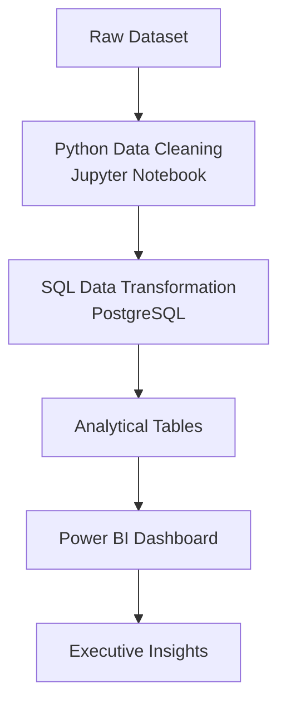
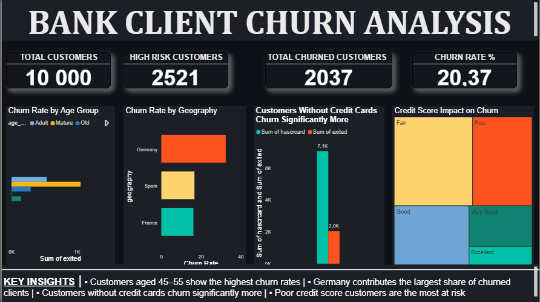
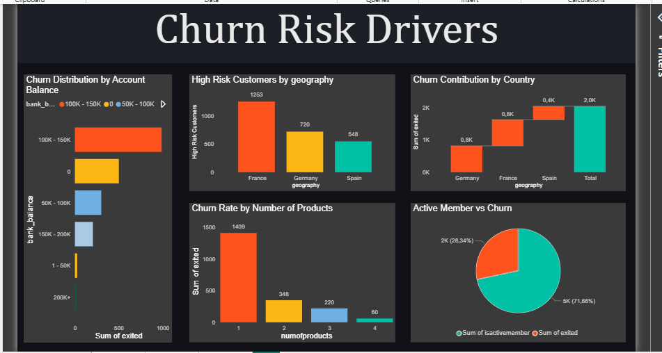
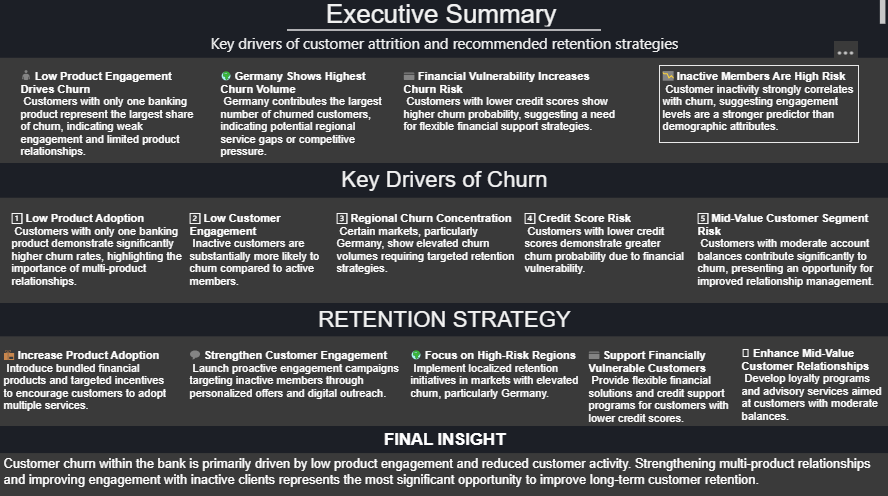

# 📊 Bank Customer Churn Analysis

A full-stack analytics project combining **Python data engineering, SQL analytics, and Power BI business intelligence** to identify key drivers of customer churn and propose retention strategies.

---

# 📌 Project Overview

This project analyzes **10,000 bank customers** to identify the primary drivers of churn and recommend data-driven retention strategies.

The workflow demonstrates a complete **end-to-end analytics pipeline**:

- Python for data cleaning and preprocessing
- SQL for analytical transformations and KPI generation
- Power BI for executive dashboards
- SQL validation for dashboard metrics

The objective is to simulate the **real workflow of a data analyst in a banking environment**, transforming raw customer data into actionable insights for leadership teams.

---
# 🚀 Key Results

- Identified **5 major drivers of customer churn** across behavioral, financial, and geographic dimensions
- Built an **end-to-end analytics pipeline (Python → SQL → Power BI)**
- Validated **all dashboard KPIs using SQL queries**
- Discovered **customers with only one product are 4× more likely to churn**
- Identified **Germany as the highest churn-contributing region**
---

# 🧠 Business Problem

Customer churn significantly impacts revenue in the banking sector. Retaining customers is often more cost-effective than acquiring new ones.

This analysis addresses the following key questions:

- Which customer segments are most likely to churn?
- What behavioral and financial attributes drive churn?
- How does geography influence churn?
- What strategies can the bank implement to reduce churn?

---

# 🛠 Tech Stack

| Tool | Purpose |
|-----|------|
| Python | Data cleaning and preprocessing |
| Pandas | Data transformation |
| Jupyter Notebook | Data preparation workflow |
| PostgreSQL | Analytical queries and aggregations |
| SQL | KPI generation and validation |
| Power BI | Interactive dashboards |
| GitHub | Project documentation |

---

# 🏗 Project Architecture

This project follows a layered analytics workflow.

## 🔄 Analytics Pipeline



This structure mirrors **enterprise BI pipelines used in real-world analytics teams**.

---

# 🧹 Data Cleaning (Python)

Initial preprocessing was performed using Python.

Key steps included:

- Handling missing values
- Standardizing categorical variables
- Correcting data types
- Removing duplicate records
- Exporting a clean dataset for SQL analysis

Example snippet:

```python
df.drop_duplicates(inplace=True)

df['age_group'] = pd.cut(
    df['Age'],
    bins=[18,35,55,100],
    labels=['Young','Adult','Senior']
)
```

Notebook included in the repository:

```
notebooks/data_cleaning.ipynb
```

---

# 🗄 SQL Data Modeling & Aggregation

SQL was used to perform analytical transformations and generate KPIs used in the dashboard.

Key analyses performed:

- Churn rate by geography
- Churn by number of products
- Customer activity vs churn
- Credit score impact on churn
- Churn distribution by account balance

Example query:

```sql
SELECT geography,
       COUNT(*) AS customers,
       SUM(exited) AS churned_customers,
       ROUND(SUM(exited)::numeric / COUNT(*) * 100,2) AS churn_rate
FROM bank_customers
GROUP BY geography
ORDER BY churn_rate DESC;
```

---

# ✔ KPI Validation (SQL)

To ensure analytical accuracy, all Power BI metrics were validated using SQL queries.

Example:

```sql
SELECT 
COUNT(*) AS total_customers,
SUM(exited) AS churned_customers,
ROUND(SUM(exited)::numeric / COUNT(*) * 100,2) AS churn_rate
FROM bank_customers;
```

Validated KPI values:

| Metric | Value |
|------|------|
| Total Customers | 10,000 |
| Churned Customers | 2,037 |
| Churn Rate | 20.37% |

This validation step reflects **best practices used in production BI environments**.

---

# 📊 Dashboard Overview

## Executive Dashboard



Provides a high-level overview of churn performance.

Metrics included:

- Total Customers
- High Risk Customers
- Total Churned Customers
- Overall Churn Rate

Key findings:

- Overall churn rate is **20.37%**
- **2,521 customers identified as high risk**

---

## Churn Risk Drivers Dashboard



Major churn drivers identified:

- Low product adoption
- Customer inactivity
- Geographic concentration
- Poor credit scores
- Mid-value customer vulnerability

---

## Business Insights Dashboard

Key insights from the analysis:

- Customers aged **45–55 exhibit the highest churn rates**
- **Germany contributes the largest share of churned customers**
- Customers **without credit cards churn significantly more**
- **Lower credit score segments show the highest churn probability**

---

# 💡 Business Recommendations

Based on the analysis, the following strategies are recommended:

### Increase Product Adoption
Customers with only one banking product show significantly higher churn.

Strategy:

- Introduce bundled financial products
- Incentivize multi-product adoption

---

### Re-Engage Inactive Customers

Inactive members show substantially higher churn risk.

Strategy:

- Launch targeted engagement campaigns
- Personalized digital outreach programs

---

### Target High-Risk Regions

Certain markets show elevated churn levels.

Strategy:

- Implement localized retention strategies in high-risk regions such as Germany.

---

### Support Financially Vulnerable Customers

Customers with lower credit scores show higher churn probability.

Strategy:

- Offer flexible financial products
- Introduce credit improvement programs

---

# 📂 Repository Structure

```
bank-churn-analysis
│
├── data
│
├── notebooks
│   └── data_cleaning.ipynb
│
├── sql
│   ├── transformations.sql
│   ├── kpi_queries.sql
│   └── validation_queries.sql
│
├── dashboards
│   └── powerbi_dashboard.pbix
│
├── images
│   └── dashboard_screenshots
│
└── README.md
```

---

# ⭐ Project Highlights

This project demonstrates:

✔ End-to-end analytics workflow  
✔ Python-based data engineering  
✔ Advanced SQL analytical queries  
✔ BI dashboard development  
✔ Data validation best practices  
✔ Business-driven insights and recommendations

The project reflects the responsibilities of a **modern data analyst working in financial services or business intelligence teams**.
